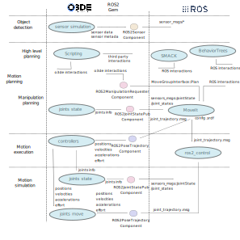

# Manipulators in O3DE - analysis

## Intro

According to the Robot Manipulation department of the University of Leeds:
robotic manipulation refers to the ways robots interact with the objects around
them: grasping an object, opening a door, packing an order into a box, folding
laundry,etc. All these actions require robots to plan and control the motion of
their hands and arms in an intelligent way.

### Manipulation areas

Organizing the different areas involved in this course of actions, the MIT
manipulation department at CSAIL propose three main points that affect to the
manipulation in robotics:

 * Perception: this includes both geometric perception to understand the local
   geometry of the objects and environment and semantic perception to understand
   what opportunities for manipulation are available in the scene.

 * Planning: typically includes reasoning about the kinematic and dynamic
   constraints of the task. But it also includes higher-level task planning.

 * Control: control the interactive forces and torques between the robot and its
   environment.

### Actuators, end effectors and sensors

The simplest manipulation approaches typically involve computer vision and a
parallel gripper and are enough for most pick and place tasks in a controlled
environment. To support more advanced manipulation force and contact sensors
can come into consideration

Beyond parallel grippers three-finger hands are useful. Anything beyond three
fingers, as the time of writing, is still under heavy research. Beyond that,
there are special cases for specialized grippers or other end effectors like
suction tools.

### Summary

Manipulation in robotics involves a set of actions that are each of them
pretty complex and sometimes shared outside of the manipulation act with other
fields in the robotics world. This document will focus on the simulation aspects
that affect the manipulation task without going deeply into others that are
also common in other robotics fields.

## Areas involved in manipulation

 * Object detection:
   * Geometry perception
   * Semantic perception
   * Sensors for manipulation perception:
     * Depth camera sensors
     * Contact sensors
     * ...

 * Motion planning:
   * High level planning of actions
   * Motion planning: planning to resolve kinematics and dynamics constraints
   * ...

 * Motion execution:
   * Trajectory execution
   * Controllers
   * ...

Note: this analysis does not include object detection. The design will also
focus on the interaction and interfaces designed to use external libraries,
software and/or frameworks already dedicated to perception, motion planning
or motion execution.

#### Considerations for implementation within the O3DE simulator

The main focus of this analysis is to provide an overview of the
capabilities that a simulator needs to implement for the simulation of manipulation tasks in approximation of a real robot and the respective design considerations and trade-offs, e.g. how hardware interaction
can be replaced by the O3DE simulator features, on which level of abstraction, and which interfaces can and should be provided.

 * Object detection (perception): as described in the introduction the sensor
   simulation is usually a basic part of manipulation workflow. This document
   does not focus on it.

 * Motion planning:

    * High level general planning: O3DE can act passively (by providing
      services to an external orchestration tool) or actively being (using
      native O3DE scripts to drive the manipulation course of actions).

    * Manipulation planning: integral manipulation planning could be delegated
      to third party libraries (such as MoveIt) or parts of the planning to
      external planners (such as OMPL). In both cases O3DE will probably need
      to provide information about the state of joints, the state of the scene,
      and other data/metadata about the state of the whole simulaton.

 * Motion execution: having the ability to use both, internal native O3DE
   motion controllers, or external controllers implemented in frameworks
   or libraries (such as ros2_control) is an important part of the
   manipulation pipeline. Note that the use of controllers is optional
   for quick prototyping so the manipulation planning could interact
   directly with the simulator without using a controller.

Diagram of input/outpus and data flows using ROS 2:

To implement these set of actions, the O3DE simulator should have at least:

 * The capacity of publish information about the state of the joints (**RO2JointStatePub** component):
   Include the needed information from O3DE simulation related to the joints of
   the simulated robot in `sensor_msgs/JointState.msg` and publish it in the `/joint_states`
   topic. This is required to interact with ROS 2 packages (such as MoveIt)
   See [gazebo_ros_pkgs plugin for reference](https://github.com/ros-simulation/gazebo_ros_pkgs/blob/galactic/gazebo_plugins/include/gazebo_plugins/gazebo_ros_joint_state_publisher.hpp#L44-L73)

 * Receive orders to move the different joints (**ROS2PoseTrajectory** component):
   Set the trajectory of points to be followed by joints in the O3DE simulation using as input
   `trajectory_msgs/msg/JointTrajectory.msg`
   See [gazebo_ros_pkgs plugin for reference](https://github.com/ros-simulation/gazebo_ros_pkgs/blob/galactic/gazebo_plugins/include/gazebo_plugins/gazebo_ros_joint_pose_trajectory.hpp#L26-L48)

 * The ability to request picks or motion movements to external manipulation planners (**ROS2ManipulationRequester**):
   Request a motion plan to external planners given different types of inputs,
   a target pose for end effector or a joint state target. MoveIt `move_group_interface` interaction
   is an example of this.
   See [MoveIt 2 joint state target goal](https://github.com/ros-planning/moveit2/blob/main/moveit_ros/planning_interface/move_group_interface/include/moveit/move_group_interface/move_group_interface.h#L305-L320)
   or [MoveIt 2](https://github.com/ros-planning/moveit2/blob/main/moveit_ros/planning_interface/move_group_interface/include/moveit/move_group_interface/move_group_interface.h#L640-L554)

 * Provide data from the simulated sensors: not in the scope of this document

For an initial implementation, a lighter version of the diagram can be an intermediate goal (simplified by danielemorra98):

## Other simulators – review of selected implementations of manipulation

The support for the simulation of manipulation is quite common among all the existing software dedicated to the robot simulation. Most of them

* [Drake](https://drake.mit.edu/): Drake is a software composed by a
  multibody dynamics engine, a “systems framework” for organizing and combining
  system models from a library into a block diagram, and a optimization
  framework for mathematical programming.
  Drake-ROS is mostly geared towards someone who is doing most things in Drake
  (like motion planning) but wants to connect to ROS for either commands or
  visualization, no integration with ros_control or Moveit.

* [IssacSim](https://docs.omniverse.nvidia.com/app_isaacsim/app_isaacsim/tutorial_advanced_adding_new_manipulator.html)
  NVIDIA simulator using NVIDIA PhysX framework. It has its own sub-product
  called [Cortex](https://docs.omniverse.nvidia.com/app_isaacsim/app_isaacsim/tutorial_cortex_overview.html)
  for implementing the whole mmanipulation pipeline from detection to control.
  It has many GUI tools to help with manipulation tuning and design.

* [Simulink](https://www.mathworks.com/solutions/robotics/robot-manipulators.html) - Mathworks.
  Mathworks offers a large collection of products to address all the aspect of
  the manipulation workflow: Use functionalities for inverse/forward kinematics
  and dynamics, motion plan, trajectory generation, and collision checking

## Design considerations

### Implementation in O3DE

### Use of MoveIt 2

[MoveIt 2](https://moveit.picknik.ai/humble/index.html) is the main motion
planner framework used by ROS 2. There are many ways of interacting with it. In
this design, the `ROS2ManipulationRequester` component should act as the
interface for accepting inputs in the form of request for manipulation and call
MoveIt 2 ([see the code needed to implement a Pose for the end
effector](https://moveit.picknik.ai/humble/doc/tutorials/your_first_project/your_first_project.html))
or any other motion planner.

The `ROS2ManipulationRequester` component should also take care of controlling
the status of the request and provide internal O3DE Gem information on the
status of the execution.

### Use of controllers: ros2_control and native O3DE

The integration of the [ros2_control](https://github.com/ros-controls/ros2_control) into the
architecture have some difficulties:

- controllers are typically not modular in a sense that they handle everything
 (parameters, communication and computations).
 - we would like to handle some of these elements separately for more
   flexibility and better UX.
- some of their design is not as flexible (likely since they have been only
 used with Gazebo so far).
 - for example, we would like to handle parameters in the Editor, without
   running publishers/subscribers already.

The benefits are important though. It is valuable to reuse implementations
which are tried and tested, and benefit from the joint effort of the community.
There should be the option of using native O3DE controllers if there is a good
reason to do so like big performance improvements or much better integration in
the UI.

Regardless of whether the controllers are `ros2_control` or native O3DE
controllers, an interface is needed to communicate between MoveIt 2 and
the controllers.

# References

https://robotics.leeds.ac.uk/research/ai-for-robotics/robotic-manipulation/
https://manipulation.csail.mit.edu/intro.html 
https://medium.com/toyotaresearch/drake-model-based-design-in-the-age-of-robotics-and-machine-learning-59938c985515 
