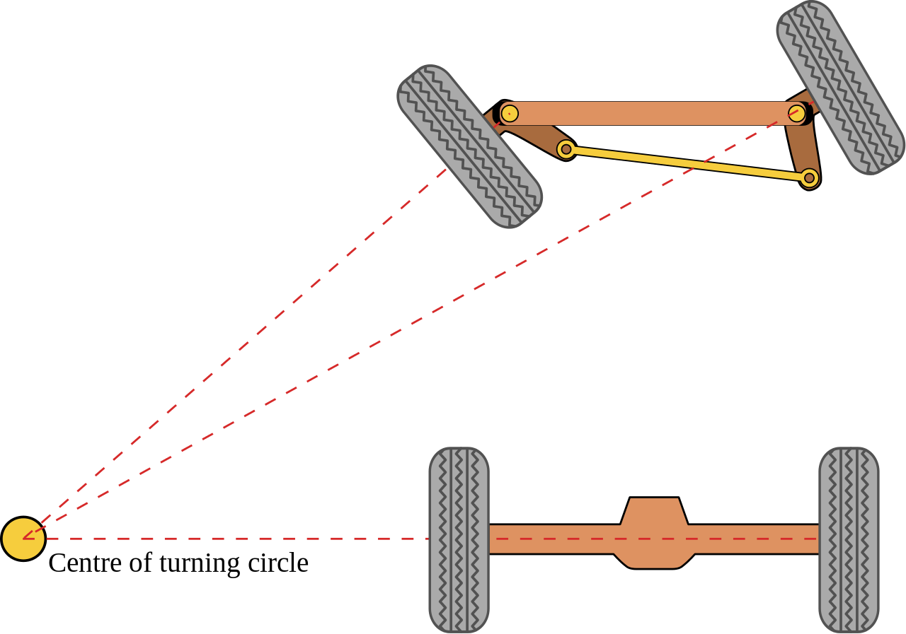

# Vehicle Physics in O3DE - analysis

## Types of robot mobility and the scope of analysis

- Airborne robots 
- Ground robots
  - **Wheeled robots**
    - **...**
  - Tracked robots
  - Walking robots 
    - Bipedal (e.g., humanoid) 
    - Quadrupedal (e.g., dogs)
    - …
  - Crawling robots (snake-like)
  - Climbing robots  
  - ... 
- (Under)water robots 
- Space robots
- ...

| This analysis only includes **wheeled robots** |
|------------------------------------------------|

## Types of wheels

There are many types of wheels and their mounting used in robotics. Some examples include:

- **Fixed wheels** – fixed to the chassis. They are used to drive the robot and to steer it (using differential drive).
- **Omni-wheels** (including Mecanum wheels): they are equipped with rollers which enable multi-directional movement. They are used both for driving and steering.
- **Castor wheels** (and balls) - passive wheels used for balance. 
- **Car-like wheels** – connected through axles, with additional steering elements, with tires. 

## Selected robot steering types

### Differential drive (skid-steering)

Two independent wheels, steering is achieved through different rates of rotation. In many cases, unpowered wheel(s) are added for balance.
This drive is also used in heavy machinery with tracks and other vehicles which traverse difficult terrain.

#### How to handle in the simulation

The desired movement can be achieved with both _**Twist**_ and _**Ackermann**_ commands, through parametrized controllers (sharing some common implementation between message types).

Optional: Sim-side controller should reflect the real controller so that similar steering is achieved.

### Car-like steering (e.g., Ackermann Steering or Side Pivot Steering)

Car steering avoids side slip on wheels when moving on a curve, which is especially important for stability at high speeds.
Less slippage also improves reliability of the odometry.

#### How to handle in the simulation

Use _**Ackermann**_ commands to control.

Provide steering component which moves the steering wheel according to the steering component of `AckermannDrive` message. This should be translated within the model into wheels’ steering.

Provide acceleration input control and a cruise control system. Implement controllers for the pipeline: Speed component of `AckermannDrive` message -> acceleration input -> force on wheel -> resulting wheel speed. 

## Other simulators – review of selected implementations of Vehicle Physics

Simulated Vehicle Dynamics / Vehicle Physics solutions are the most common. Some support a wider range of vehicles such as trucks, construction vehicles, boats; some are dedicated to cars. Some are a part of a vehicle design, development, and validation package. Selected examples are:

- [Vehicle Dynamics Blockset](https://www.mathworks.com/products/vehicle-dynamics.html) – Mathworks. Features include modeling propulsion, steering, suspension, vehicle bodies, brakes, and tires.
- [Vehicle Physics Pro](https://vehiclephysics.com) – a kit for Unity 3D. A comprehensive set of customizable features for vehicle dynamics, driving assists, extensions, and useful tools for simulation of cargo and automation.  
- [NWH Vehicle Physics 2](http://nwhvehiclephysics.com) – a vehicle simulation package for Unity 3D. Modular architecture with sub-solvers (e.g., for drivetrain) and plenty of components. Supports external modules for features such as cruise control and trailers. 
- [CarSim](https://www.amet.it/en/software/carsim-en/) – Amet. Standalone application with support for SiL, MiL, HiL and interface to MATLAB / Simulink. Aside from vehicle dynamics it also supports sensors and traffic. It comes with plenty of example vehicles. 
- [Simcenter](https://www.plm.automation.siemens.com/global/en/products/simulation-test/vehicle-dynamics.html) - Vehicle System Dynamics Simulation (Siemens). Integrated solution for developing vehicles and validation process using MiL, SiL and HiL. 

## Design considerations

#### Loss of connection or control

In robotics, it is typical to expect relatively high frequency on drive command topic, and to zero inputs if nothing arrives after expected time.

**Solution**: restart a timeout after receiving an input. On timeout, zero inputs (steering, speed).

#### Implementation in O3DE

Vehicle Dynamics feature will use O3DE abstractions of physics engine. 
JointComponent(s), RigidBodyComponent(s) and other O3DE-level components will be used as means to achieve the behavior. 
However, once PhysX Vehicle Gem is made available in O3DE, the design could be switched to use it instead. The implementation
following this design and our experiences could prove to be informative for preparing the Vehicle Gem.

#### Use of ros2_control

In the second design phase, we will be looking to integrate elements of [ros2_control](https://github.com/ros-controls/ros2_control) into the architecture.
There are some challenges with this:
- controllers are typically not modular in a sense that they handle everything (parameters, communication and computations).
  - we would like to handle some of these elements separately for more flexibility and better UX.
- ackermann controller is not yet included in ros2_control
- some of their design is not as flexible (likely since they have been only used with Gazebo so far).
  - for example, we would like to handle parameters in the Editor, without running publishers/subscribers already. 

The benefits are important though. It is valuable to reuse implementations which are tried and tested, and benefit from the joint effort of the community. 