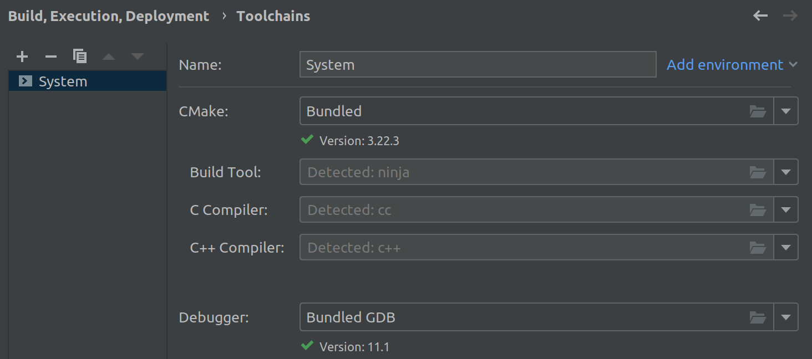
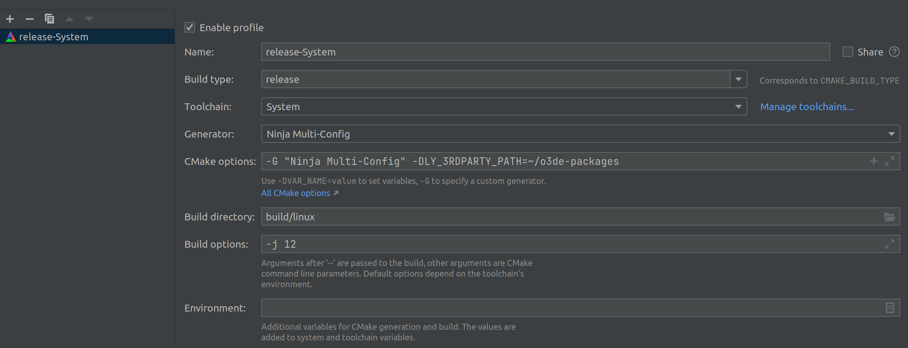
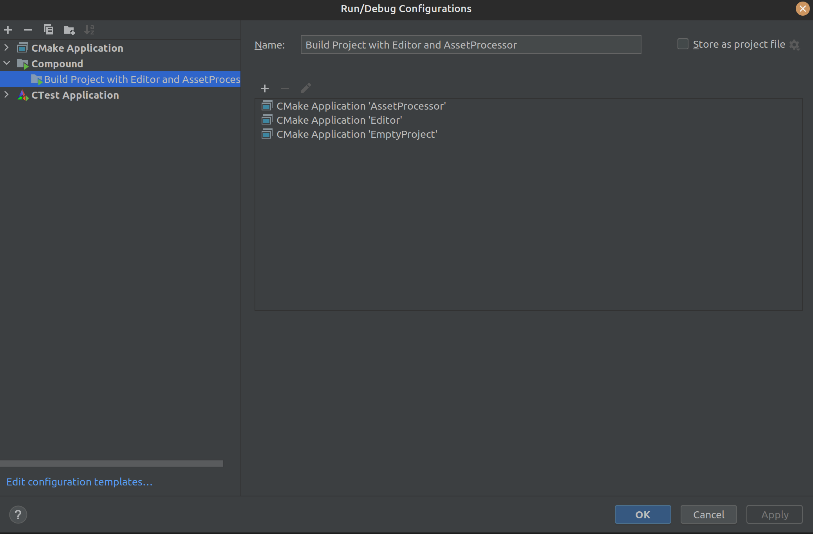

# Gem Development - Clion

## Clion Project Setup

### Requirements

These steps assume that you:

- have met all of the o3de engine requirements
- have installed the o3de engine (source)
- have registered the engine
- have met all of the [o3de ros2 gem requirements](https://github.com/RobotecAI/o3de-ros2-gem#requirements)
- have installed the Clion IDE

### Creating and Configuring the Clion Project

```bash
cd <directory_of_choice>
git clone https://github.com/RobotecAI/o3de-ros2-gem.git
# <gem_path> = <directory_of_choice>/o3de-ros2-gem
cd <o3de_install_dir>
mkdir ~/o3de-projects
scripts/o3de.sh create-project --pp ~/o3de-projects/<project-name>
# <project_path> = ~/o3de-projects/<project-name>
scripts/o3de.sh register --gem-path <gem_path>
scripts/o3de.sh enable-gem -gn ROS2 -pp <project_path>
```
💡 ***Note:*** Some commands may generate cycle dependency errors but they can be ignored since this is a known o3de engine bug ([this issue](https://github.com/o3de/o3de/issues/10515)).


1. Open Clion and select the `<project_path>` folder.
2. In the Clion IDE interface select *File/Settings/Build, Execution, Deployment*.
    1. Create a new toolchain that matches the one provided below.
        
        
        
    2. Create a new CMake profile (*under CMake*) that matches the one provided below (*build type can for now be Debug; we will change that when we load the CMake project*).
        
        You can adjust the **-j** flag (*use the **nproc** bash command*).
        
        
        
        ```
        CMake options:
        -G "Ninja Multi-Config" -DLY_3RDPARTY_PATH=~/o3de-packages
        Build options:
        -j 12
        ```
        
3. Now in the IDE interface right click on the **CMakeLists.txt** file under the **<project_name>** directory and select **Load CMake Project** option.
4. You should now be able to select between release, debug and profile Build types and see the o3de and the gem folders in Project files. Let the Clion perform all of the background tasks and you’re good to go!

### Building the Project

In the Select *Run/Debug Configuration* you should be able to see all the Configurations generated by CMake. You can now create compound configurations that allow you to build and run the project (for example Project (name of your project) with Editor and AssetProcessor).



## Code Formatting

Make sure to enable ClangFormat in the Clion Interface under *File/Settings/Editor/Code Style.* Clion should detect the **.clang-format** file (*located in the root directory of the gem*) automatically.

To reformat the code simply select *Code/Reformat Code* (**Ctrl+Alt+L**).