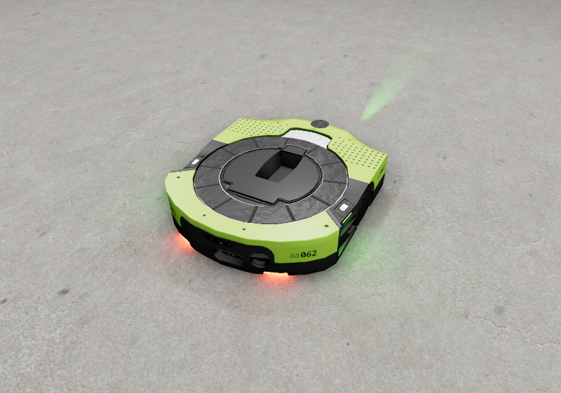
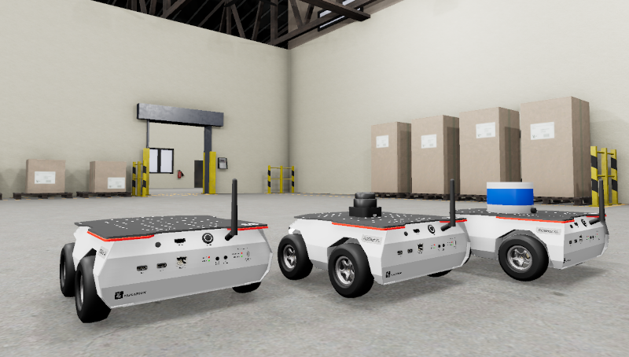

[![Apache License, Version 2.0][apache_shield]][apache]

# Sample ROS2 Robots
This is an Asset Gem containing sample robots for the O3DE:

- Proteus Robot
- Husarion ROSbot XL

## Requirements
- Any O3DE project with the [ROS 2 Gem](https://docs.o3de.org/docs/user-guide/interactivity/robotics/) enabled.

Please refer to [O3DE documentation](https://docs.o3de.org/docs/user-guide/gems/) to learn more about Gems and about registering Gems in the system and O3DE projects.

## Proteus Robot

### Description
The folder `ProteusRobot` contains a simplified model of [Proteus Robot](https://robotsguide.com/robots/proteus) - an autonomous mobile robot that can pick up, transport, and drop off containers. It is delivered as a ready-to-use O3DE prefab, `Proteus.prefab`, containing visual models, physics and the following ROS 2 components:
- `ROS2 Frame`
- `ROS2 Robot Control`
- `ROS2 Skid Steering Twist Control`
- `ROS2 Lidar Sensor`

Additionally, the model is equipped with links that are suitable for adding `Camera` and `Imu` sensors.

The robot publishes Lidar Sensor's output on the`/base_link/pc` ROS 2 topic and can be driven using the `/base_link/cmd_vel` ROS 2 topic. An example of its use can be found in [ROS 2 Project Template](https://github.com/o3de/o3de-extras/tree/development/Templates/Ros2FleetRobotTemplate).

### Screenshots

## Husarion ROSbotXL

### Description
The folder `RosbotXL` contains the [Husarion ROSbot XL](https://husarion.com/manuals/rosbot-xl/) robot - an autonomous mobile robot platform developed by [Husarion](https://husarion.com). The robot is delivered as a ready-to-use prefab, `ROSbotXL.prefab`, containing visual models, physics and the following ROS 2 components:
- `ROS2 Frame`
- `ROS2 Robot Control`
- `ROS2 Skid Steering Twist Control`

Additionally, the model is equipped with links that are suitable for adding `Camera` and `Imu` sensors. There are two extra O3DE prefabs with 2D and 3D LiDAR sensors attached: `ROSBot_slamtec.prefab` and `ROSbot_velodyne.prefab` with Slamtec RPLIDAR S1 and Velodyne Puck VLP-16 sensors respectively. The components are visualized with the corresponding meshes. 

The robot publishes Lidar Sensor's output on the`/base_link/pc` ROS 2 topic and can be driven using the `/base_link/cmd_vel` ROS 2 topic. An example of its use can be found in [ROS 2 Project Template](https://github.com/o3de/o3de-extras/tree/development/Templates/Ros2ProjectTemplate).

### Screenshots

From left: `ROSbotXL_Velodyne.prefab`, `ROSBotXL_Slamtec.prefab`, and `ROSbotXL.prefab`

From left: `ROSbotXL.prefab`, `ROSBotXL_Slamtec.prefab`, and `ROSbotXL_Velodyne.prefab`

## Acknowledgments
This work is licensed under [Apache License, Version 2.0][apache]. You may elect at your option to use the [MIT License][mit] instead. Contributions must be made under both licenses.

Models were created based on STL and URDF files kindly shared by Husarion.

[apache]: https://opensource.org/licenses/Apache-2.0
[mit]: https://opensource.org/licenses/MIT
[apache_shield]: https://img.shields.io/badge/License-Apache_2.0-blue.svg