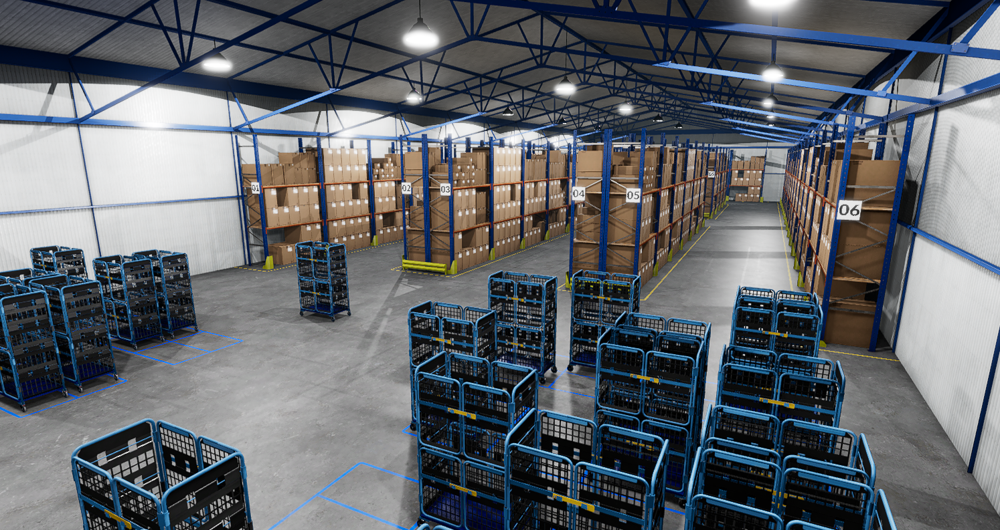
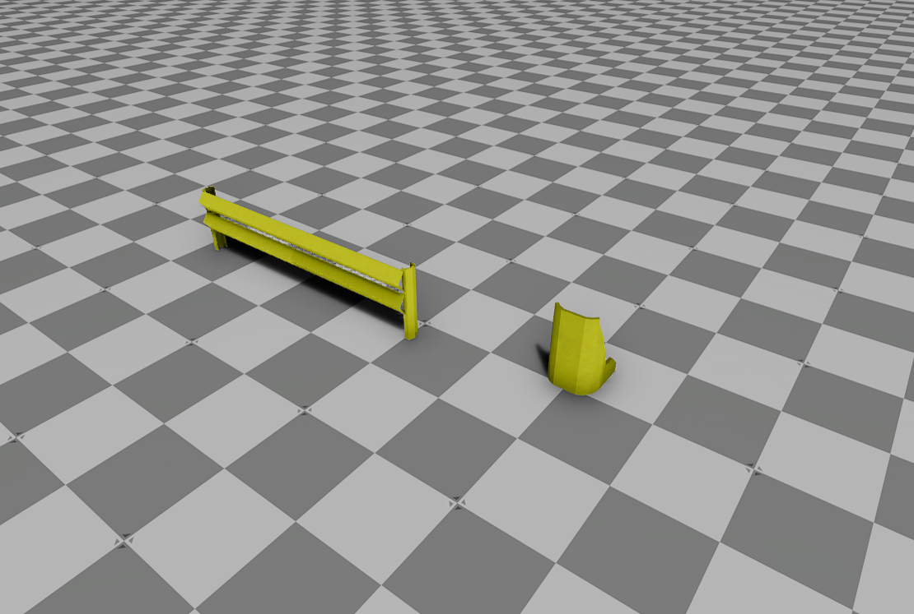
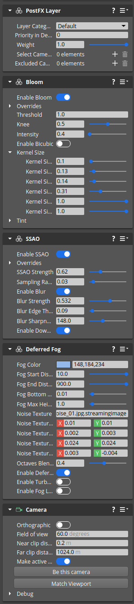

## Warehouse Assets Gem ##

### General description ###

This gem contains a set of models and prefabs which can be used to create a Warehouse project suitable for robotic simulations.

### Contents ###

All of the contents of this gem reside in the folder `Assets`. It comprises 2 sub-folders:

- `assets` containing models, textures, and material definitions
- `Prefabs` containing prefabs that can be used to build the scene

The `Prefabs` folder has the following structure:

All the prefabs have appropriate physics parameters including collision shape.

#### Basic Components ####

A set of basic items to be used in the warehouse is located in the `Components` folder. The prefabs (on the image, left to right): 

- `WarehouseRack.prefab` 
- `WarehouseBox1.prefab` 
- `WarehouseBox2.prefab`
- `WarehouseBox3.prefab`
- `WarehouseBox4.prefab`

#### Storage Racks ####

Storage racks are created from basic components, combined in 5 different permutations. The prefabs (on the image, left to right): 

- `Storage_rack1.prefab`
- `Storage_rack2.prefab`
- `Storage_rack3.prefab`
- `Storage_rack4.prefab`
- `Storage_rack5.prefab`

#### Storage Rack Packs ####

The rack packs were created by stacking 4 storage rack prefabs in different combinations. These prefabs may simplify creating larger warehouses. The prefabs (on the image, left to right): 

- `Storage_2x2_Pack1.prefab`
- `Storage_2x2_Pack2.prefab`
- `Storage_2x2_Pack3.prefab`

#### Storage on Wheels ####

`Storage_on_wheels.prefab` is a storage cage on wheels. As opposed to other prefabs it can be moved around the scene. The collision shape was designed in a way, that allows the Proteus robot to ride below it.

#### Rack protection ####

There are 2 elements, located in the `Rack_protectors` folder, that can be placed next to the racks. These are (on the image, left to right):

- `Rack_front_protection.prefab`
- `Rack_side_protection.prefab`

#### Misc ####

The `Misc` folder contains prefabs with floor lines.

#### Warehouse structural ####

The `Warehouse_structural` folder contains prefabs comprising the warehouse building. These are:

- `Warehouse_Floor.prefab`
- `Warehouse_Walls.prefab`
- `Warehouse_Roof.prefab`

The folder contains also a `Components` subfolder, containing assets used in these 3 prefabs.

#### Warehouse scene ####

The `WarehouseScene.prefab` contains a sample, read-to-use warehouse scene, built from prefabs listed in this document.

### Tips on using Warehouse Assets Gem ###

#### Creating Warehouse scene ####

***Tip 1***

To achieve alignment, all 3 "structural" prefabs should be instantiated in the same coordinates.

***Tip 2***

Each of the frontal walls in the `Warehouse_Walls.prefab` contains optional gate openings and gates. It consists of 3 entities:

- `Front_no_gates` - solid wall without opening
- `Front_gate` - wall with gate opening
- `Gate` - gate matching the opening

Each of them can be activated or deactivated by enabling or disabling PhysX Collider and Mesh components. It is possible to obtain one of the following variants:

1. Solid wall - enable `Front_no_gates`, disable the other 2
2. Open gate - enable `Front_gate`, disable the other 2
3. closed gate - enable `Front_gate` and `Gate`, disable `Front_no_gates`

***Tip 3***

Warehouses with open gates may be connected by placing them one after another.

#### Visual quality ####

***Tip 4***

For best visual results when using the `WarehouseScene.prefab` it is advised to apply the following effects to the camera entity:

- Bloom
- SSAO
- Deferred Fog

A sample set of parameters can be seen in this image:

***Tip 5***

The `WarehouseScene.prefab` is equipped with 2 Reflection Probes, which can be found in: `Warehouse/Global_illumination/Reflection_Probe`. To work correctly, Reflection Probes require baked materials, thus are disabled by default. For a better visual experience, it is advised to enable them. To do so follow these steps:

1. Open the `WarehouseScene.prefab`
2. Navigate to `Warehouse/Global_illumination` and locate 2 `Reflection_Probe` entities.
3. Select each of them, enable the `Reflection Probe` component, and click `Bake Reflection Probe`

