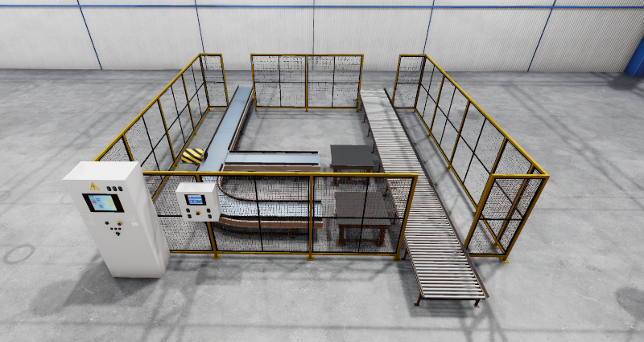
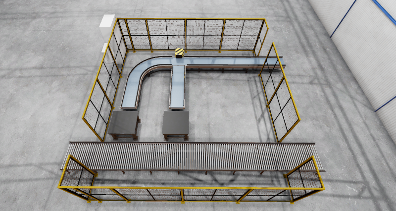

[![Apache License, Version 2.0][apache_shield]][apache]

# Warehouse Automation Gem for Open 3D Engine (O3DE)

## Requirements
- Any O3DE project with the [ROS 2 Gem](https://docs.o3de.org/docs/user-guide/interactivity/robotics/) enabled.

Please refer to [O3DE documentation](https://docs.o3de.org/docs/user-guide/gems/) to learn more about Gems and about registering Gems in the system and O3DE projects.

## Description
This Gem contains a set of models and prefabs with underlying O3DE components that can be used to create a warehouse simulation scene. It includes a conveyor belt with visuals and physical simulation as well as a proximity sensor that can be used to stop the belt, such as when transported goods reach a certain position. The conveyor belt is built from smaller pieces that can be put together in any configuration, allowing for twists and turns. Additionally, this Gem includes a sample palletizer configuration, in which one conveyor belt splits and feeds into two pick-up stations for robotic arms, and an extra roller conveyor for putting aside goods.

The following assets are available in the Gem as O3DE prefabs:
- `./Assets/Factory/ConveyorLine.prefab` - a sample palletizer configuration
- `./Assets/Factory/ConveyorElements/ConveyorSegments_Turnout.prefab` - conveyor belt's element that splits into two and allows for goods distribution using a mechanized flap
- `./Assets/Factory/ConveyorElements/ConveyorSegments_Straight.prefab` - conveyor belt's straight element
- `./Assets/Factory/ConveyorElements/ConveyorSegments_Turn_90.prefab` - conveyor belt's turn element (90 degrees)
- `./Assets/Factory/ConveyorElements/ConveyorSegments_End.prefab` - conveyor belt's end element with an extra flap to keep transported goods positioned

Images of all prefabs are given in the next section.

The proximity sensor is an O3DE component with no corresponding visualization. It uses `AzPhysics::RayCastRequest` to check for collisions in its range and returns continuously the result of this test via `ProximitySensorNotificationBus`. Any O3DE component can connect to this bus and react to certain events. The sensor and the bus are also available for scripting in [ScriptCanvas](https://docs.o3de.org/docs/user-guide/scripting/script-canvas/). It is possible to set the frequency and the range of the sensor. The visualization beam can be disabled.

The Gem was implemented primarily for [ROSCon2023Demo](https://github.com/RobotecAI/ROSCon2023Demo) project. An example of its use can be also found in [ROS 2 Project Template](https://github.com/o3de/o3de-extras/tree/development/Templates/Ros2RoboticManipulationTemplate).

## Screenshots

### Conveyor belt parts

From left: `ConveyorSegments_End.prefab`, `ConveyorSegments_Turn_90.prefab`, `ConveyorSegments_Turnout.prefab`, and `ConveyorSegments_Straight.prefab`

### Sample palletizer configuration

Sample palletizer configuration with conveyor belt split into two pick-up stations (no robotic arms available in this Gem) and a roller conveyor for pallets.

### Proximity sensor

Three instances of proximity sensors with a cube mesh primitive used for visualization. Note different range configurations between the left and the middle sensors. The beam of the right sensor is green due to the detection of a sample box.

## Acknowledgments
This work is licensed under [Apache License, Version 2.0][apache]. You may elect at your option to use the [MIT License][mit] instead. Contributions must be made under both licenses.

[apache]: https://opensource.org/licenses/Apache-2.0
[mit]: https://opensource.org/licenses/MIT
[apache_shield]: https://img.shields.io/badge/License-Apache_2.0-blue.svg