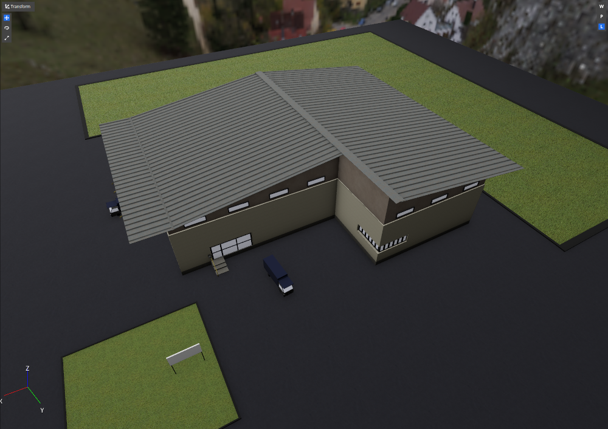
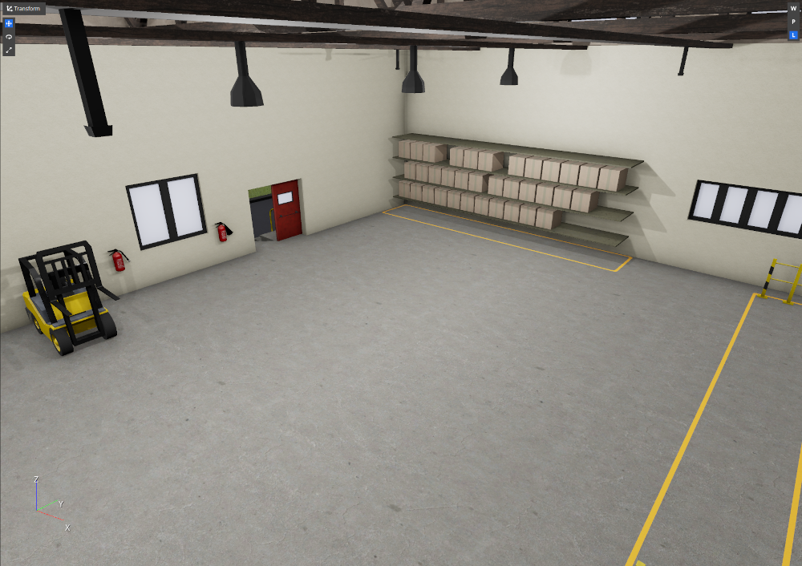

[![Apache License, Version 2.0][apache_shield]][apache]

# WarehouseSample Gem for Open 3D Engine (O3DE)

## Installation
Please refer to [O3DE documentation](https://docs.o3de.org/docs/user-guide/gems/) to learn more about Gems and about registering Gems in the system and O3DE projects.

## Description
This is an Asset Gem. It contains the sample warehouse asset that was developed for [ROS2 Project Template](https://github.com/o3de/o3de-extras/tree/development/Templates/Ros2ProjectTemplate). The asset is stored as a separate Gem to make it reusable in other projects, is it available as an O3DE prefab `Warehouse.prefab` stored in `Assets/O3DEScene/Prefabs` folder.

The warehouse consists of two rooms and some space outside of the building. Please note, that the whole asset is scaled down, i.e., the dimensions of the building are relatively small for most applications.

## Screenshots

## Acknowledgments
This work is licensed under [Apache License, Version 2.0][apache]. You may elect at your option to use the [MIT License][mit] instead. Contributions must be made under both licenses.

The warehouse models are based on CC0 asset available [online](https://www.blendswap.com/blend/21850).

[apache]: https://opensource.org/licenses/Apache-2.0
[mit]: https://opensource.org/licenses/MIT
[apache_shield]: https://img.shields.io/badge/License-Apache_2.0-blue.svg