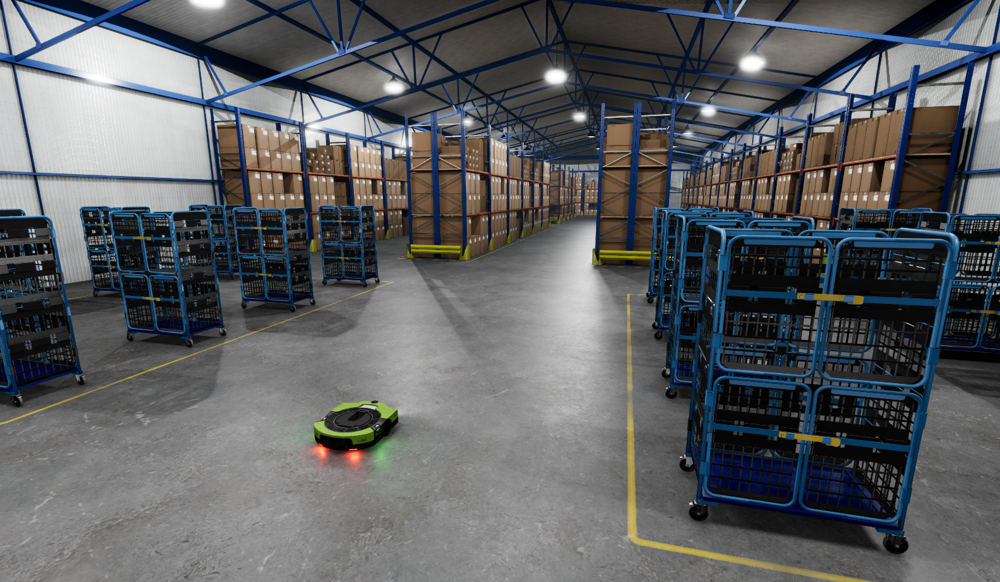
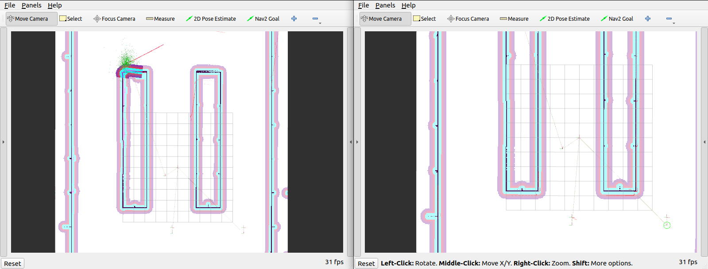

# ROS2 Fleet Template

Welcome to Robotic Simulation Fleet template for ROS 2 projects!
This project is a template designed to help you quickly start simulating robots in Open 3D Engine (O3DE) with Robot Operating System (ROS) 2.

This template focuses on use-cases with multiple robots in environments such as warehouses and fulfillment centers.
The warehouse assets used in the template are modular and well-suited for reconfiguration to match a custom warehouse.
If your simulation does not match this and you would like to start with a simple and versatile template, consider using a more generic template:
- [ROS 2 Project Template](https://github.com/o3de/o3de-extras/tree/development/Templates/Ros2ProjectTemplate).



## Set up a new project with the template

Please follow the instructions in [ROS 2 Gem documentation](https://development--o3deorg.netlify.app/docs/user-guide/interactivity/robotics/project-configuration/)
to install all required dependencies and create your project with a template (make sure to use chose this template during the process).

## Spawning robots

The level contains spawn points configured to easily add more Proteus robots through ROS 2 calls.

This is done with the [Spawner Component](https://development--o3deorg.netlify.app/docs/user-guide/interactivity/robotics/concepts-and-components-overview/#spawner).
There are 4 spawn points already added in the level. You can use them all with the following service calls:

```shell
ros2 service call /spawn_entity gazebo_msgs/srv/SpawnEntity '{name: 'proteus', xml: 'spawnPoint1'}'& \
ros2 service call /spawn_entity gazebo_msgs/srv/SpawnEntity '{name: 'proteus', xml: 'spawnPoint2'}'& \
ros2 service call /spawn_entity gazebo_msgs/srv/SpawnEntity '{name: 'proteus', xml: 'spawnPoint3'}'& \
ros2 service call /spawn_entity gazebo_msgs/srv/SpawnEntity '{name: 'proteus', xml: 'spawnPoint4'}'
```

## Fleet navigation

This template comes with the example fleet navigation ROS 2 package called `o3de_fleet_nav`. You can find a prepared ROS 2 workspace in the `Examples` directory.

This package contains a modified code from `nav2_bringup` package (https://github.com/ros-planning/navigation2).

In this example, a fleet of robots is automatically spawned and each individual robot can be controlled via the Rviz2. An AMCL localization is used for robot localization.

> Notice: Before running an automated fleet example, please make sure your level doesn't contain any robots in it (they will be spawned).

### Fleet configuration

You can configure the fleet by modifying `Example/ros2_ws/src/o3de_fleet_nav/config/fleet_config.yaml` file:

```
fleet:
  - robot_name: proteus
    robot_namespace: robot1
    position: 
      x: -6.0
      y: 0.5
      z: 0.2
  - robot_name: proteus
    robot_namespace: robot2
    position: 
      x: -6.0
      y: 7.5
      z: 0.2
  - robot_name: proteus
    robot_namespace: robot3
    position: 
      x: -6.0
      y: -6.0
      z: 0.2
```

This configuration file contains the data about each robot in a fleet:
- name (a type of the robot to spawn), 
- namespace (must be unique per spawned robot),
- spawning position (spawn position is also used as an AMCL initial estimation). 

In this example, only the `proteus` robot is supported.

You can modify contents of this file to add/remove robots or change their initial positions.

> Notice: You have to rebuild the ROS 2 workspace for changes to update.

### Navigation configuration

You can configure navigation parameters by modifying `Examples/ros2_ws/src/o3de_fleet_nav/params/<ROS_DISTRO>/nav2_*.yaml` files.

Please visit the [nav2 configuration guide](https://navigation.ros.org/configuration/index.html) for a detailed description of the navigation parameters.

> Notice: You have to rebuild the ROS 2 workspace for changes to update.

### Topics and frames

Every spawned robot will have its own namespace for all topics. For the first robot ('robot1' namespace), these will be:

- `/robot1/cmd_vel`: The topic to [control the robot](https://development--o3deorg.netlify.app/docs/user-guide/interactivity/robotics/concepts-and-components-overview/#robot-control).
- `/robot1/scan` - The topic of simulated 2D laser scanner sensor.

The first spawned robot also provides the following transformations:

- `/robot1/odom`
- `/robot1/base_link`
- `/robot1/lidar`

To understand more about transformations, see ROS 2 navigation [documentation](https://navigation.ros.org/setup_guides/transformation/setup_transforms.html).

## Using your robots in the simulation

You can also use your robots in the simulation. To do so, you need to:
- [import robot](https://docs.o3de.org/docs/user-guide/interactivity/robotics/importing-robot/) from existing URDF file,
  - or create a robot from scratch in a O3DE editor using ROS 2 gem components (see [Frames](https://docs.o3de.org/docs/user-guide/interactivity/robotics/concepts-and-components-overview/#frames)),
- make sure that your robot has a 2D scanner attached 
  - and publishes scans on `scan` topic (see [Sensors](https://docs.o3de.org/docs/user-guide/interactivity/robotics/concepts-and-components-overview/#robot-control)),
- is controlled via the `cmd_vel` topic (see [Robot Control](https://docs.o3de.org/docs/user-guide/interactivity/robotics/concepts-and-components-overview/#robot-control)).

When you have your robot set up:
- create a prefab out of it (skip if URDF importer did that for you),
- load the `Warehouse` level,
- assign the prefab to the `RobotSpawner` entity inside `ROS2 Spawner Component` with a preferred name.

Then you can alter `fleet_config.yaml` file to change the robot name to the assigned one, and start the fleet simulation with your robot!

### Building

- Source ROS 2:
```
. /opt/ros/humble/setup.bash
```

- Go to the ROS 2 workspace:
```
cd Examples/ros2_ws
```

- Install ROS 2 dependencies:
```
rosdep update
rosdep install --from-paths src -y --ignore-src
```

- Build workspace:
```
colcon build --symlink-install
```

### Running

- Run the `Warehouse` level in O3DE editor.

- Source ROS 2 and the `o3de_fleet_nav` workspace:
```
. /opt/ros/humble/setup.bash
```

- Source the `o3de_fleet_nav` workspace:
```
cd Examples/ros2_ws
. ./install/setup.bash
```

- Run the fleet example:
```
ros2 launch o3de_fleet_nav o3de_fleet_nav_launch.py
```

Few Rviz2 windows should appear. You can use the "Nav2 Goal" button to send goal to the robot.


