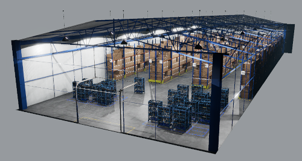
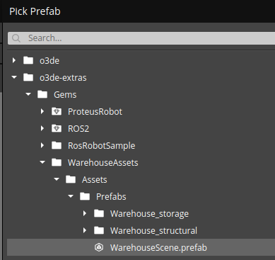
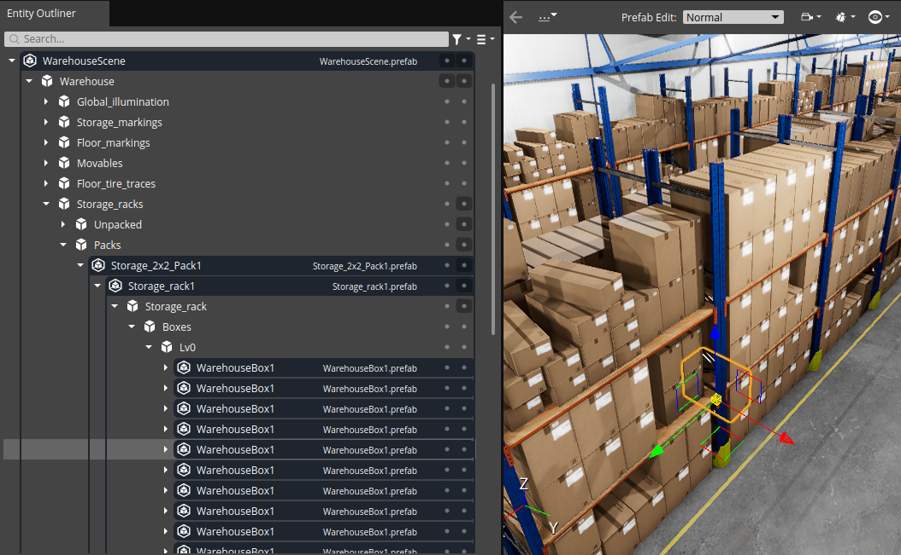
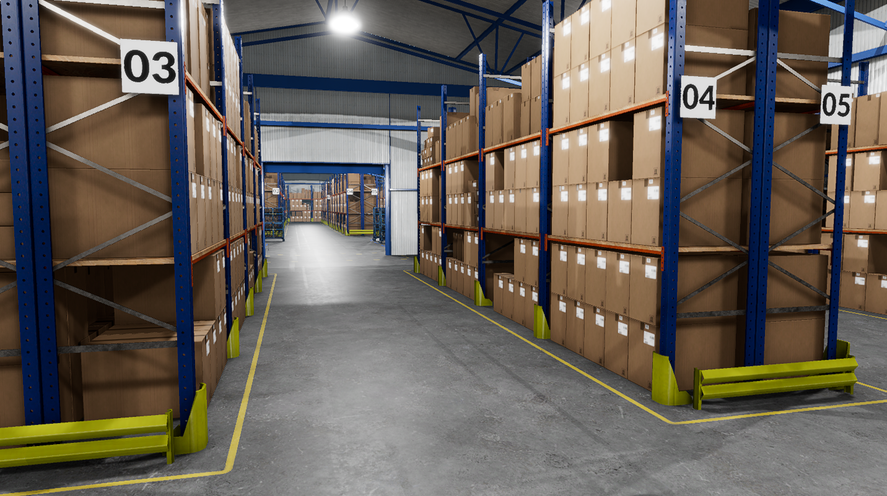
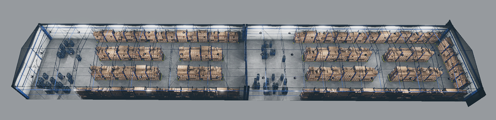
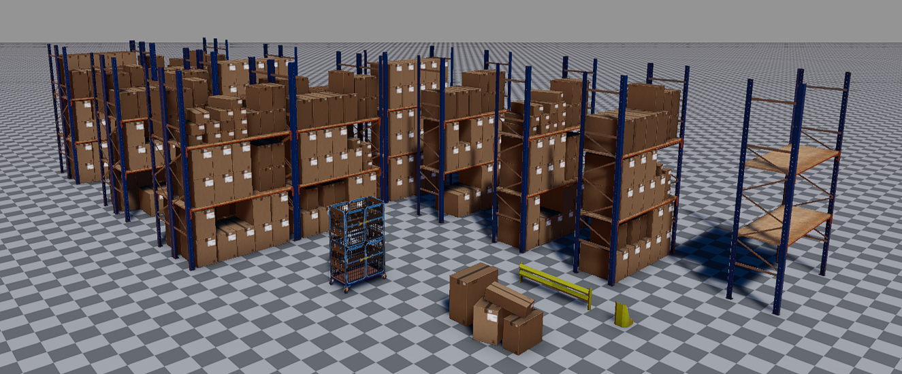

# Warehouse Scene Creation Guidelines

This document describes the process of creating and modifying the warehouse scene which is the basis of the ROS 2 Fleet Template. All the prefabs and assets used in this scene can be found in the [Warehouse Assets Gem](../../../Gems/WarehouseAssets). Before proceeding please take a look at [README](../../../Gems/WarehouseAssets/README.md) of this Gem. You'll find a list of all included objects and some useful tips there.

## Importing the ready-to-use warehouse scene

The fastest and simplest way to create your own warehouse scene is to import the `WarehouseScene.prefab`. You can find it in the following location:

You can also type WarehouseScene in the search field of the `Pick Prefab` dialog.

> Note: to find out more about instantiating prefabs please refer to [this document](https://www.o3de.org/docs/learning-guide/tutorials/entities-and-prefabs/entity-and-prefab-basics/#instantiate-a-prefab).

For best visual results it is advised to do following things:

- The `WarehouseScene` prefab is equipped with all the necessary lights. Any global or environmental lighting may interfere with internal lights. In particular, if you are creating the scene from scratch using the default O3DE template, you should consider removing all child entities of the `Atom Default Environment/` except for the camera.
- In the Tips section of the [Warehouse Assets Gem documentation](../../../Gems/WarehouseAssets/README.md) you'll find a description of the camera configuration which will help achieve better visual results.

> Note: the ROS 2 Fleet Template already contains a scene with the `WarehouseScene.prefab` and fully configured camera.

## Modifying the warehouse scene

If you have the `WarehouseScene` prefab on your scene you can easily apply modifications. It is possible to alter virtually any object on the scene, remove it or add a new one. The structure of the `WarehouseScene` prefab contains a few levels of nested prefabs (please refer to [this document](../../../Gems/WarehouseAssets/README.md) for a description). For example, prefabs with boxes are located inside prefabs with storage racks, which are often located in storage packs (containing 4 racks). See the image below.

You can alter objects on each level by removing, scaling or moving any objects. For example, you can:

- re-arrange boxes on shelves by translating and rotating existing ones, or adding new ones,
- remove boxes from a shelf to make places for different objects,
- remove the whole storage rack,
- translate racks to different locations.

Another type of modification concerns the warehouse structure. As described in the [Warehouse Assets Gem README Tips](../../../Gems/WarehouseAssets/README.md), you can easily change frontal walls by replacing the solid wall with open gates. This way you can stack two or more warehouses, one after the other.

> Note: in O3DE there are 2 ways you can alter instantiated prefab: by changing prefab instance or prefab definition (source). If you modify prefab source, all instances will be altered. Thus unless you really know what you are doing, you should edit instances only. Simple hint: do not double-click on the prefab in the Entity Outliner. When double-clicking the editor enters focused mode, prefab is highlighted in blue, changes will be saved in the prefab source. Please refer to [this document](https://www.o3de.org/docs/learning-guide/tutorials/entities-and-prefabs/entity-and-prefab-basics/) to learn about working with prefabs.

## Creating the warehouse scene

According to your needs, you may also create a custom warehouse using selected assets from the Warehouse Assets Gem. As described in the [Warehouse Assets Gem README](../../../Gems/WarehouseAssets/README.md), the gem contains structural assets defining the building and various objects to be placed inside. Structural assets include 3 prefabs:

- floor,
- walls with gates,
- roof with lights.

To achieve alignment, all these prefabs should be instantiated with the same transform (position, rotation and scale). Besides the building structure, the gem provides a set of different objects to be used in the warehouse. These are arranged into prefabs with different levels of nesting. You can import the empty rack and place boxes on it, but you can also instantiate ready-to-use prefab with racks and boxes or pack of 4 racks. Of course, nothing prevents you from modifying such prefabs after instantiating.

> Note: please refer to the [Warehouse Assets Gem README](../../../Gems/WarehouseAssets/README.md) for exact list of objects and instructions.
