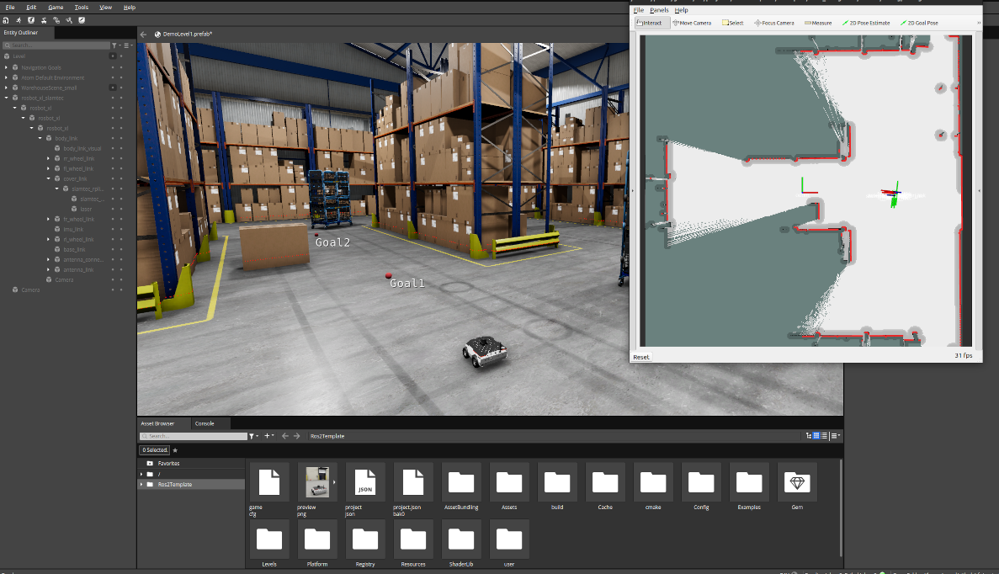

# Robotic Simulation Project Template for ROS 2

Welcome to Robotic Simulation template for ROS 2 projects!
It is designed to help you quickly start simulating robots in Open 3D Engine (O3DE) with Robot Operating System (ROS) 2.

This template has the following characteristics:
- It is the simplest and using the least resources among templates.
- Comes with Husarion ROSBot XL model, equipped with lidar and a differential drive.
- The interior scene does not look photorealistic but is quite simple.

An example ROS 2 navigation stack launch file is bundled with the template.

To learn about other robotic templates, please refer to documentation of  
[Robotic templates](https://development--o3deorg.netlify.app/docs/user-guide/interactivity/robotics/overview/#templates).

## Set up a new project with the template

Please follow the instructions in [ROS 2 Gem documentation](https://development--o3deorg.netlify.app/docs/user-guide/interactivity/robotics/project-configuration/)
to install all required dependencies and create your project with a template (make sure to use chose this template during the process).

## ROS 2 integration example

You can try out an example of ROS 2 integration with the navigation stack.
Follow the [instructions](https://github.com/o3de/o3de-extras/tree/development/Templates/Ros2ProjectTemplate/Template/Examples/slam_navigation/README.md) to navigate your robot with ROS 2!
