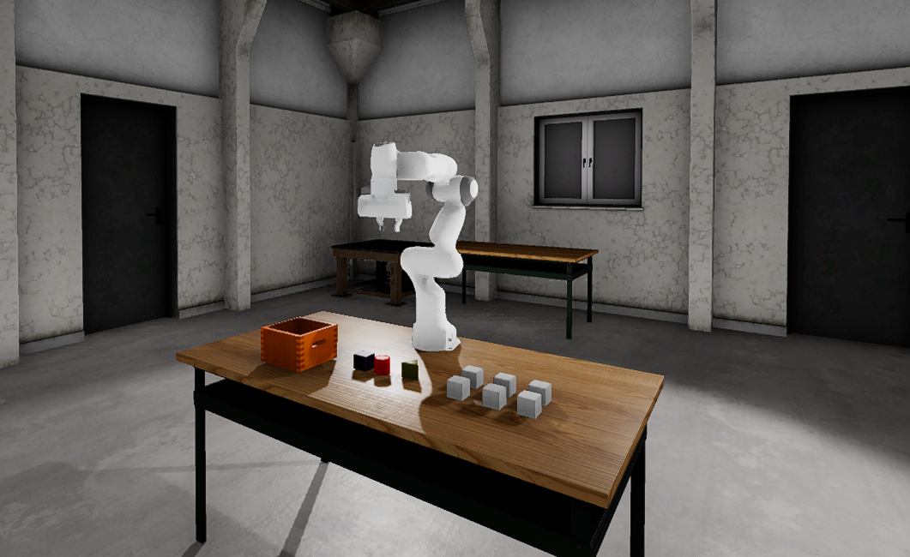
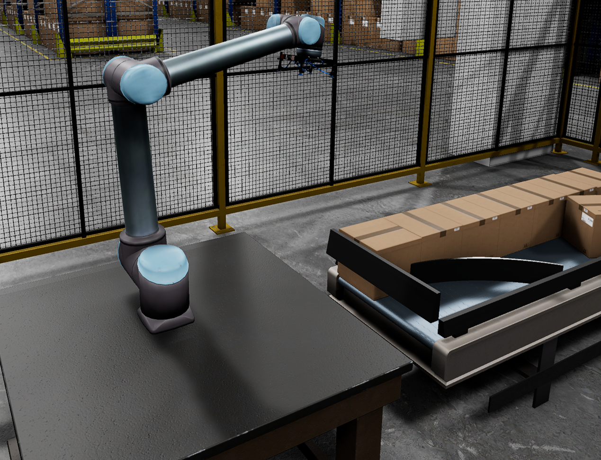
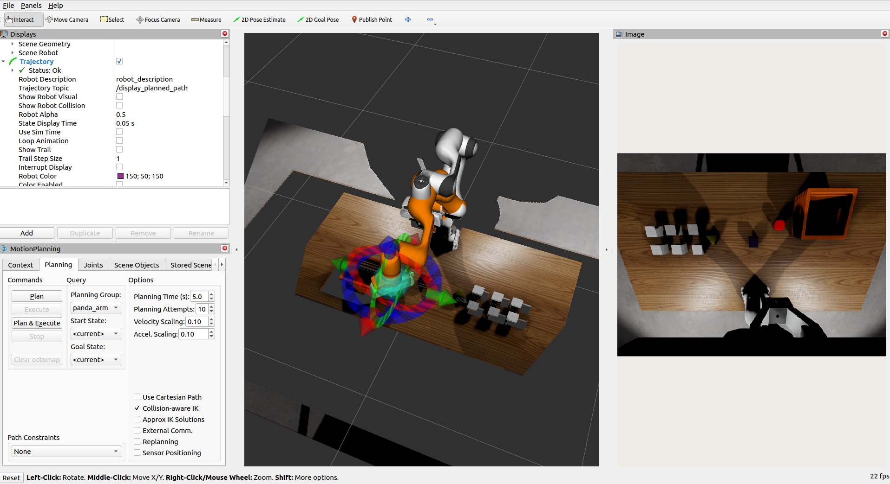

# ROS2  Robotic Manipulation Template

This project is a template designed to help you quickly start simulating robotic arms in Open 3D Engine (O3DE) with Robot Operating System (ROS) 2.

This template focuses on robotic arm manipulation with ROS 2 and [MoveIt 2](https://moveit.picknik.ai/main/index.html).


## How to set up a new project with the template

Please follow the instructions in [ROS 2 Gem documentation](https://development--o3deorg.netlify.app/docs/user-guide/interactivity/robotics/project-configuration/)
to install all required dependencies and create your project with a template.

If you followed the steps, your environment variables for `O3DE_HOME` and `PROJECT_PATH` will be set, your template registered.
Create a new project with the following command:

```shell
${O3DE_HOME}/scripts/o3de.sh create-project --project-path $PROJECT_PATH --template-name Ros2RoboticManipulationTemplate
```

## Levels

A new project created with this template has two levels to address two different groups of use-cases.

### RoboticManipulation

A level to try manipulation on, also suitable for solving picking and vision challenges in isolation. 
It includes a [Panda Franka](https://www.franka.de/) manipulator, which is a popular choice in AI and manipulation research in the robotic community, RGBD camera, and some small objects to try manipulation with.

The simulated robot is imported from public repository [panda_description](https://github.com/ros-planning/moveit_resources/tree/humble/panda_description).



### RoboticPalletization

This level is more suitable for simulation of industrial use-cases with palletization. 
Includes a warehouse scene, [UR10](https://www.universal-robots.com/products/ur10-robot/), which is an industrial, collaborative robot (cobot), and packages on a conveyor belt.



## Examples 

### Manipulation

Install necessary ROS packages for MoveIt and depth image processing:

```bash
sudo apt-get install ros-humble-moveit ros-humble-moveit-resources ros-humble-depth-image-proc
```

And run the launch file in the project:

```bash
ros2 launch Examples/panda_moveit_config_demo.launch.py
```

This will result in RViz window appearing.
Now you should be able to use `Motion Planning` from `moveit_ros_visualization package`.
To understand more about MoveIt and robotic manipulation, see [tutorials](https://moveit.picknik.ai/main/doc/tutorials/quickstart_in_rviz/quickstart_in_rviz_tutorial.html#getting-started).



## Palletization

The simulated robot can be controlled with MoveIt2 stack with the use of [Universal_Robots_ROS2_Driver](https://github.com/UniversalRobots/Universal_Robots_ROS2_Driver).
Clone the driver repository and follow the [installation guide](https://github.com/UniversalRobots/Universal_Robots_ROS2_Driver#build-from-source).
Make sure to source new packages with the following command in the package workspace top directory:
```
source install/setup.bash
``` 

Following that, run the launch file and you will be able to command trajectories to the robotic arm.

```bash
ros2 launch ur_moveit_config ur_moveit.launch.py ur_type:=ur10 use_sim_time:=true use_fake_hardware:=true
```

## Working with custom manipulator

Use the [Robot Importer]((https://docs.o3de.org/docs/user-guide/interactivity/robotics/importing-robot/)) to import your robot into the O3DE Editor.


