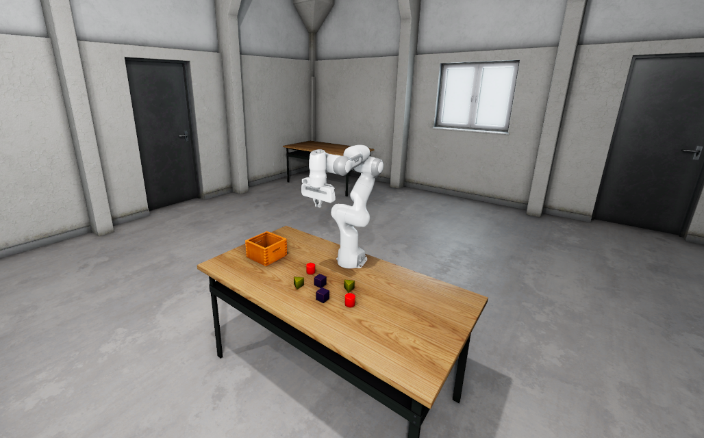

# ROS 2 Robotic Manipulation Template

This project is a template designed to help you quickly start simulating robotic arms in Open 3D Engine (O3DE) with Robot Operating System (ROS) 2.

This template focuses on robotic arm manipulation with ROS 2 and [MoveIt 2](https://moveit.picknik.ai/main/index.html).

To learn about other robotic templates, please refer to documentation of  
[Robotic templates](https://development--o3deorg.netlify.app/docs/user-guide/interactivity/robotics/overview/#templates).

To understand how the manipulation feature works in O3DE, please refer to [Joints Manipulation Documentation](https://development--o3deorg.netlify.app/docs/user-guide/interactivity/robotics/joints-manipulation/).

## Prerequisites 

Make sure that your system meets [Requirements](https://development--o3deorg.netlify.app/docs/welcome-guide/requirements/).

Install ROS 2 dependencies for this template:
```bash
sudo apt install ros-${ROS_DISTRO}-moveit ros-${ROS_DISTRO}-moveit-resources ros-${ROS_DISTRO}-depth-image-proc
```
## How to set up a new project with the template

Please follow the instructions in [ROS 2 Gem documentation](https://development--o3deorg.netlify.app/docs/user-guide/interactivity/robotics/project-configuration/)
to install all required dependencies and create your project with a template.

If you followed the steps, your environment variables for `O3DE_HOME` and `PROJECT_PATH` will be set, your template registered.
Create a new project with the following command:

```shell
${O3DE_HOME}/scripts/o3de.sh create-project --project-path $PROJECT_PATH --template-name Ros2RoboticManipulationTemplate
```

## RoboticManipulation Level

A new project created with this template includes a level to try manipulation on. This level is also suitable for solving picking and vision challenges in isolation. 
It includes a [Panda Franka](https://www.franka.de/) manipulator, which is a popular choice in AI and manipulation research in the robotic community, RGBD camera, and some small objects to try the manipulation with.

The simulated robot is imported from public repository [panda_description](https://github.com/ros-planning/moveit_resources/tree/humble/panda_description).



## Manipulation example

And run the launch file in the project:

```bash
ros2 launch Examples/panda_moveit_config_demo.launch.py
```

This will result in RViz2 window appearing.
Now you should be able to use `Motion Planning` from `moveit_ros_visualization package`.
To understand more about MoveIt and robotic manipulation, see [tutorials](https://moveit.picknik.ai/main/doc/tutorials/quickstart_in_rviz/quickstart_in_rviz_tutorial.html#getting-started).


## Working with custom manipulator

### Robot importing 
Import a robot using URDF, XACRO or SDFormat into O3DE using the provided [tutorial](https://docs.o3de.org/docs/user-guide/interactivity/robotics/importing-robot/).  
During importing check the ```Use articulation for joints and rigid bodies``` on the last page of the importer.

### Configuring the robot
To the root entity of your newly created prefab add 3 new components.
- JointsArticulationControllerComponent (controls the robots movements)
- JointsTrajectoryComponent (listens for the MoveIt trajectory messages)
- JointsManipulationEditorComponent (publishes joint_states and sets the initial position)

Enable motors on all joints and set ```motor force limit```, ```stiffness``` and ```damping``` values. 

In the ```JointsManipulationEditorComponent``` add initial positions for all of the joints (the joint names can be found in the prefabs entities inside the ROS2FrameComponent joint name). The initial positions are in radians.  
In the ```JointsTrajectoryComponent``` input the topic for controlling the trajectory. Usually this topic ends with ```joint_trajectory_controller```. The exact name of the topic will be available in the MoveIt configuration files.  
Start the simulation and see as the robot sets itself into its initial position (if something is not right check the O3DE console for logs, which include all joint names). The robot is now ready for being controlled using MoveIt.

### MoveIt configuration
Prepare the MoveIt launch files. This can be achieved by creating the files manually, using the already existing configuration provided with your robot or using the [MoveIt Setup Assistant](https://moveit.picknik.ai/main/doc/examples/setup_assistant/setup_assistant_tutorial.html).
